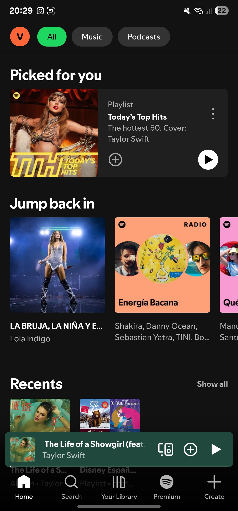
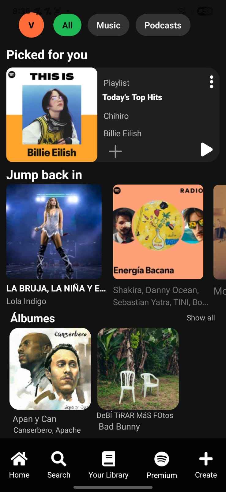

# 🎧 Aplicación Spotify
## 📄 Documentación del desarrollo

[1.- Colores](./docs/colores.md)
[2.- Atomic Desing](./docs/atomic-design.md)
[3.- Componente Propio](./docs/componente-propio.md)
[4.- Iconos](./docs/iconos.md)

## 📱 Descripción del proyecto
Este proyecto fue realizado por mi persona Gabriel David Gelviz Monterrey. Es una reacreación de la interfaz de Spotify(VISUAL), desarrolada con React Native y Expo.

## Objetivo.
El objetivo ha sido reproducir una pantalla de Spotify aplicando el principio de Atomic Design, utilizando componentes core de React Native y componentes propios, así como librerías externas como @expo/vector-icons y **@rneui/themed

## 🖼️ Comparación visual

Captura Original

Captura Del Resultado Final

# Emulacion y pruebas
El funcionamiento de la aplicacion fue probada por Expo go por un dispositivo Android y se veia correctamente lo visualm los elementos etc.

🧾 Conclusión

El desarrollo de esta aplicación ha permitido poner en práctica los conocimientos sobre:

Creación y uso de componentes en React Native

Aplicación de Atomic Design para la estructura modular

Uso de librerías externas como Expo e iconos vectoriales

Pruebas en emuladores móviles

👨‍💻 Autor
Gabriel David Gelviz Monterrey.

